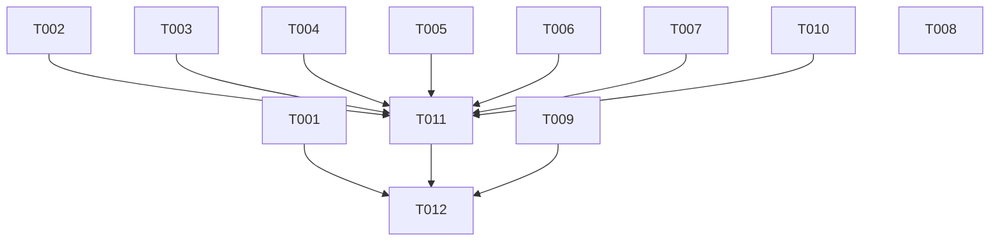

# CLI Tam Onarım — Artım 1 Uygulama Planı

> **Ajan çalışanlar için:** Görev görev, paltimate execute skill'ine göre yürüt. Adımlar `- [ ]` checkbox. Görev başlıkları `plan-tools.mjs`'in okuduğu makine-okur meta veri taşır.

## GOAL

**Palbase CLI'ın kapıları ölçmüyor ve bu yüzden beş kusuru yayına çıktı. Bu koşu kapıları gerçek araçla ölçer hâle getirir ve kalan dört P0'ı kapatır.** Merkez kanıt: `palbase start`'ı kıran geçersiz compose için bir düzeltme yazıldı (`ca3565c`), vendorlama testi yeşil kaldı, `v0.53.0` kesildi — ve `docker compose config` dosyayı bugün hâlâ reddediyor. Kapı, gerçek aracı çalıştırmak yerine taklit ettiği için bir düzeltmeyi düzeltme-olmayandan ayırt edemedi. Koşu bittiğinde: vendor'lanan compose `docker compose config`'ten geçer, CI gofmt/vet/golangci-lint/e2e koşar ve bunlar **doğduğu gün yeşildir** (lint borcu aynı koşuda ödenir), `flags list` tablo basar, `notifications remove` gerçekten siler, Android istemcisi üretilebilir, ve `init`→`build` ile `start`→`stop` uçtan uca testlerle kapıya bağlanır.

Top 3 constraints: (1) **Kapı önce, düzeltme sonra** — T001'de kapı KIRMIZI görülmeden artefakt düzeltilmez; kırmızı görülmemiş kapı hiçbir şey kanıtlamaz. (2) **Kapı doğduğu gün yeşil olmalı** — advisory kapı yok; bir kapı ancak kendisini yeşil yapan iş bittikten sonra CI'a bağlanır. (3) **CLI'ın kullanıcıya bastığı her dize İngilizce** (`sdk/cli/CLAUDE.md`).

**Mimari:** Go/cobra CLI, tek modül `github.com/palgroup/palbase-cli`, `main`'de tek yazıcı. · **Tech Stack:** Go 1.26.6 (go.mod pini), docker compose 5.5.0, golangci-lint 2.12.2, GitHub Actions.

## Fidelity Audit

- Şartnamede dayanağı olmayan öğe: **none** — Impact Map'in 36 satırının hepsi bir göreve bağlı, her görevin `files:` satırı bir Impact Map satırından geliyor.
- Bileşen yüzeyinden farklı imza: **none** — tek `C-n` olan `C-2 providerConfigID` T007'de birebir kullanılıyor.
- Planlama sırasında yapılan şartname değişiklikleri: **A-1** (FR-018 lint borcu eklendi; FR-005 kapıyı bloklayıcı yaptığı hâlde borç ölçülmemişti), **A-2** (FR-015 regresyon kapısına döndü; P0-2 27.1.0 ile kapandı), **A-3** (rota-literal kapısı Kapsam Dışı'na taşındı — kapısı doğduğu gün kırmızı olurdu; C-3/C-4 düştü; `stackfiles.go` Impact Map'ten çıktı).

## Global Constraints

- Kullanıcıya basılan dizeler **İngilizce** (`sdk/cli/CLAUDE.md`).
- **Tek yazıcı, `main`'de**; worktree ve yan branch yasak.
- Commit'ler **pathspec ile** (aynı depoda eşdüzey oturumlar çalışıyor).
- `go.mod` `go 1.26.6`; golangci-lint yerel koşumda `GOTOOLCHAIN=go1.26.6` ister (makinede Go 1.27 kurulu, lint onun stdlib'ini ayrıştıramıyor).
- **NFR-001** `go test ./... -short` ≤ 180 sn · **NFR-002** CI işi ≤ 20 dk · **NFR-003** `-short` ağsız geçmeli.

---

## Görevler

### T001: Compose kapısını gerçek araca bağla, sonra artefaktı düzelt
<!-- deps: [] | files: [internal/backend/stackfiles_test.go, internal/backend/stackfiles/docker-compose.dev.yml] | satisfies: [FR-001, FR-002] -->

**Interfaces:**
- Consumes: —
- Produces: `composeConfigIsValid(t *testing.T, path string)` — vendor'lanan compose'u gerçek `docker compose config`'e verir; docker yoksa `t.Skip` (C-1).

- [x] **Adım 1: Kapıyı yaz (henüz kırmızı olmalı)** — `internal/backend/stackfiles_test.go` sonuna ekle:
```go
// composeConfigIsValid hands the vendored document to the REAL tool.
//
// The equality test above compares two strings that both pass through
// withoutBarman, so a defect in that function is invisible to it — measured
// twice: the invalid file shipped in v0.52.0, and its fix shipped in v0.53.0
// with the file still invalid. Only docker can say whether docker accepts it.
func composeConfigIsValid(t *testing.T, path string) {
	t.Helper()
	if _, err := exec.LookPath("docker"); err != nil {
		t.Skip("docker is not on PATH — the compose document was NOT validated")
	}
	cmd := exec.Command("docker", "compose", "-f", path, "config", "--services")
	cmd.Env = append(os.Environ(), "PALBASE_HTTP_PORT=1", "PALBASE_PROJECT_DIR=/tmp")
	out, err := cmd.CombinedOutput()
	if err != nil {
		t.Fatalf("docker rejects the vendored compose document:\n%s", strings.TrimSpace(string(out)))
	}
}

func TestTheVendoredComposeIsAValidComposeProject(t *testing.T) {
	dir := t.TempDir()
	path := filepath.Join(dir, composeFile)
	if err := os.WriteFile(path, stackCompose, 0o644); err != nil {
		t.Fatal(err)
	}
	composeConfigIsValid(t, path)
}
```
- [x] **Adım 2: Kırmızı olduğunu GÖR** — Run: `go test ./internal/backend/ -run TestTheVendoredComposeIsAValidComposeProject -count=1` · Beklenen: **FAIL**, çıktıda `service "barman" refers to undefined volume barmandata: invalid compose project`. Bu satır görülmeden Adım 3'e geçme.
- [x] **Adım 3: `withoutBarman`'ın sınır hatasını düzelt** — `internal/backend/stackfiles_test.go` içindeki blok-sonu aramasını, geri yürünen `start` yerine **orijinal** `barman:` satırından başlat:
```go
	origin := -1
	for i, l := range lines {
		if l == "  barman:" {
			origin = i
			break
		}
	}
	if origin < 0 {
		return doc, false
	}
	start := origin
	// Walk back over the comment block that introduces it.
	for start > 0 && (strings.HasPrefix(lines[start-1], "  #") || lines[start-1] == "") {
		start--
	}
	end := len(lines)
	// Search from the SERVICE line, not from the comment we walked back over:
	// topLevelKey skips comments, so starting at start+1 made `  barman:` itself
	// the first match and the service survived the cut.
	for i := origin + 1; i < len(lines); i++ {
		if topLevelKey(lines[i]) {
			end = i
			break
		}
	}
```
- [x] **Adım 4: Vendor'lanan dosyayı yeniden üret** — `barman:` servisini (`internal/backend/stackfiles/docker-compose.dev.yml` satır ~182-213, onu tanıtan yorum bloğu dâhil) ve `volumes:` bloğundaki öksüz Barman yorumunu sil. `barmandata` anahtarı zaten yok; servis gidince tutarlı olur.
- [x] **Adım 5: Yeşil olduğunu GÖR** — Run: `go test ./internal/backend/ -run 'Vendored|Barman' -count=1` · Beklenen: **PASS** (hem yeni geçerlilik testi hem mevcut eşitlik testi).
- [x] **Adım 6: Commit** — `fix(start): vendor'lanan compose GEÇERLİ — ve kapı artık gerçek docker'a soruyor`

---

### T002: e2e paketini derlenir hâle getir [P]
<!-- deps: [] | files: [tests/e2e/mgmt_api_test.go] | satisfies: [FR-007] -->

**Interfaces:**
- Consumes: `auth.LoadDPoPKey()` (argümansız — güncel imza)
- Produces: derlenen `tests/e2e` paketi

- [x] **Adım 1: Kırmızıyı gör** — Run: `go vet -tags e2e ./tests/e2e/` · Beklenen: **FAIL** — `too many arguments in call to auth.LoadDPoPKey / have (string) / want ()`
- [x] **Adım 2: Çağrıyı güncel imzaya getir** — `tests/e2e/mgmt_api_test.go:53`'teki `auth.LoadDPoPKey(<arg>)` çağrısından argümanı kaldır; argüman emekli `PALBASE_MODE` kablosundan geliyorsa onu taşıyan yerel değişken/kurulum satırlarını da sil (kullanılmayan değişken bırakma).
- [x] **Adım 3: Yeşili gör** — Run: `go vet -tags e2e ./tests/e2e/` · Beklenen: **çıktı yok, exit 0**
- [x] **Adım 4: Commit** — `fix(e2e): LoadDPoPKey çağrısı güncel imzaya — paket yeniden derleniyor`

---

### T003: Lint borcu — `internal/backend`
<!-- deps: [] | files: [internal/backend/start.go, internal/backend/pull_spec.go, internal/backend/deploy.go, internal/backend/stack_bundle.go, internal/backend/stack_push.go, internal/backend/schema_sources.go, internal/backend/archive.go, internal/backend/stack_bundle_test.go, internal/backend/plan_test.go] | satisfies: [FR-018] -->

**Interfaces:**
- Consumes: —
- Produces: `internal/backend` paketinde sıfır golangci-lint bulgusu

- [x] **Adım 1: Bu paketin borcunu listele** — Run: `GOTOOLCHAIN=go1.26.6 golangci-lint run ./internal/backend/... 2>&1 | tail -40` · Beklenen: errcheck 2 (`start.go`), staticcheck 5 (`start.go`, `stack_push.go`, `stack_bundle.go`, `schema_sources.go`, `archive.go`), unused 15 (`pull_spec.go` 5, `deploy.go` 4, `stack_bundle.go` 1, `stack_bundle_test.go` 3, `plan_test.go` 2)
- [x] **Adım 2: GERÇEK KUSURU düzelt (E-3) — `.env` mühür yazımı** — `internal/backend/start.go` içinde sealing değerlerini ekleyen `defer f.Close()` kalıbını, hatayı döndüren açık kapanışa çevir:
```go
	if _, err := f.WriteString(block); err != nil {
		_ = f.Close()
		return fmt.Errorf("append the sealing chain to %s: %w", path, err)
	}
	if err := f.Close(); err != nil {
		return fmt.Errorf("close %s after writing the sealing chain: %w", path, err)
	}
```
  Gerekçe yorumu ekle: kısa yazım sessizce yarım mühürlü bir yığın bırakıyordu.
- [x] **Adım 3: İkinci errcheck'i düzelt** — `start.go`'daki `defer os.RemoveAll(...)` çağrısını hatayı kontrol eden bir yardımcıya bağla ya da `//nolint` yerine gerçek kontrol koy (paketin zaten `removeTemp` yardımcısı var — gerekçesi "en kötü ihtimalle OS süpürür"; o gerekçe geçerliyse `removeTemp` kullan).
- [x] **Adım 4: staticcheck bulgularını düzelt** — ST1005 (hata metni noktalama/newline ile bitmemeli) `stack_bundle.go`, `stack_push.go`, `start.go`; QF1001/S1016 `archive.go`, `schema_sources.go`. Hata metinlerinin ANLAMINI değiştirme, yalnız biçimini.
- [x] **Adım 5: Ölü sembolleri sil** — `pull_spec.go` (5), `deploy.go` (4 kullanılmayan alan), `stack_bundle.go` (1), `stack_bundle_test.go` (3 test yardımcısı), `plan_test.go` (2 test yardımcısı). Silmeden önce her biri için `grep -rn "<ad>" --include="*.go" .` koş ve sıfır çağıran olduğunu doğrula.
- [x] **Adım 6: Yeşili gör** — Run: `GOTOOLCHAIN=go1.26.6 golangci-lint run ./internal/backend/...` · Beklenen: **`0 issues`**; ardından `go build ./... && go test ./internal/backend/ -count=1 -short` · Beklenen: **PASS**
- [x] **Adım 7: Commit** — `fix(backend): lint borcu ödendi — .env mühür yazımı artık Close hatasını yutmuyor`

---

### T004: Lint borcu — diğer paketler [P]
<!-- deps: [] | files: [internal/auth/auth_test.go, internal/storage/storage.go, internal/egress/egress.go, internal/logs/logs.go, internal/project/gitroot.go, cmd/palbase/doctor.go] | satisfies: [FR-018] -->

**Interfaces:**
- Consumes: —
- Produces: bu paketlerde sıfır golangci-lint bulgusu

- [x] **Adım 1: Borcu listele** — Run: `GOTOOLCHAIN=go1.26.6 golangci-lint run ./internal/auth/... ./internal/storage/... ./internal/egress/... ./internal/logs/... ./internal/project/... ./cmd/... 2>&1 | tail -30` · Beklenen: unused 18 + staticcheck 2
- [x] **Adım 2: `internal/project/gitroot.go` dosyasını TÜMÜYLE sil** — `gitRunner`, `execGit`, `ensureGitRepo` üçü de ölü. Doğrula: `grep -rn "ensureGitRepo\|gitRunner" --include="*.go" .` → yalnız bu dosya. (`internal/backend/deploy.go`'da AYRI bir `execGit` var, o canlı — karıştırma.)
- [x] **Adım 3: config/*.ts döneminden kalan ölü sembolleri sil** — `storage.go`: `bucketDef`, `parseSizeLiteral`, `describe`, `humanBytes` · `egress.go`: `hostEntryRE`, `hostsArrayRE`, `lineCommentRE` · `logs.go`: `reverse` · `auth_test.go`: 7 ölü test yardımcısı. Her biri için önce sıfır çağıran doğrulaması.
- [x] **Adım 4: staticcheck'leri düzelt** — `logs.go` ve `cmd/palbase/doctor.go` (QF1002 tip switch biçimi).
- [x] **Adım 5: Yeşili gör** — Run: `GOTOOLCHAIN=go1.26.6 golangci-lint run ./internal/auth/... ./internal/storage/... ./internal/egress/... ./internal/logs/... ./internal/project/... ./cmd/...` · Beklenen: **`0 issues`**; `go build ./...` · Beklenen: exit 0
- [x] **Adım 6: Commit** — `chore(lint): config/*.ts döneminin ölü sembolleri silindi (gitroot.go tümüyle)`

---

### T005: Türkçe dizeleri çevir ve kapıyı koy
<!-- deps: [] | files: [internal/transport/rest.go, internal/auth/auth.go, internal/auth/dpop_storage.go, internal/project/project.go, cmd/palbase/surface_test.go] | satisfies: [FR-009] -->

**Interfaces:**
- Consumes: —
- Produces: `TestNoUserFacingStringIsTurkish` kapısı

- [x] **Adım 1: Kapıyı yaz (kırmızı olmalı)** — `cmd/palbase/surface_test.go` sonuna:
```go
// TestNoUserFacingStringIsTurkish holds sdk/cli/CLAUDE.md's rule: the task may
// be Turkish, the CLI's output may not. Comments are exempt — only string
// literals inside the calls that reach a terminal are measured.
func TestNoUserFacingStringIsTurkish(t *testing.T) {
	turkish := regexp.MustCompile(`[çğıöşüÇĞİÖŞÜ]`)
	emit := regexp.MustCompile(`(?:Errorf|Fprintf|Fprintln|Sprintf|errors\.New)\(`)
	var offenders []string
	roots := []string{"..", "../../internal", "../../cmd"}
	seen := map[string]bool{}
	for _, root := range roots {
		_ = filepath.Walk(root, func(path string, info os.FileInfo, err error) error {
			if err != nil || info.IsDir() || !strings.HasSuffix(path, ".go") ||
				strings.HasSuffix(path, "_test.go") || seen[path] {
				return nil
			}
			seen[path] = true
			src, rerr := os.ReadFile(path)
			if rerr != nil {
				return nil
			}
			for i, line := range strings.Split(string(src), "\n") {
				trimmed := strings.TrimSpace(line)
				if strings.HasPrefix(trimmed, "//") || !emit.MatchString(line) {
					continue
				}
				for _, lit := range regexp.MustCompile(`"[^"]*"`).FindAllString(line, -1) {
					if turkish.MatchString(lit) {
						offenders = append(offenders, fmt.Sprintf("%s:%d %s", path, i+1, lit))
					}
				}
			}
			return nil
		})
	}
	if len(offenders) > 0 {
		t.Fatalf("user-facing strings must be English (sdk/cli/CLAUDE.md):\n%s",
			strings.Join(offenders, "\n"))
	}
}
```
- [x] **Adım 2: Kırmızıyı gör** — Run: `go test ./cmd/palbase/ -run TestNoUserFacingStringIsTurkish -count=1` · Beklenen: **FAIL**, üç ihlali adıyla listeler
- [x] **Adım 3: Üç dizeyi çevir** —
  - `internal/transport/rest.go:313` → `fmt.Errorf("could not produce a DPoP proof: %w", perr)`
  - `internal/auth/auth.go:322` → `fmt.Errorf("the identity response was not JSON: %w", err)`
  - `internal/auth/dpop_storage.go:73` → `fmt.Errorf("could not read %s: %w", DPoPKeyEnv, err)`
- [x] **Adım 4: Yeşili gör** — Run: `go test ./cmd/palbase/ -run TestNoUserFacingStringIsTurkish -count=1` · Beklenen: **PASS**
- [x] **Adım 5: Commit** — `fix(cli): terminale düşen üç Türkçe dize İngilizceye — ve dönüşünü kapı engelliyor`

---

### T006: `flags list` zarfı çözsün + paketin ölü sembollerini sil
<!-- deps: [] | files: [internal/flags/flags.go, internal/flags/flags_test.go] | satisfies: [FR-012, FR-018] -->

**Interfaces:**
- Consumes: sunucu şekli `{"flags":[{key,type,value,description}]}` (kanıt: `research.md` CB-10)
- Produces: zarf çözen `flags list`

- [x] **Adım 1: Fikstürü GERÇEK sunucu şekline çevir ve kırmızıyı gör** — `internal/flags/flags_test.go:129` civarındaki fikstür bugün çıplak dizi döndürüyor; `{"flags":[…]}` zarfına çevir. Run: `go test ./internal/flags/ -count=1` · Beklenen: **FAIL** — CLI zarfı çözemediği için tablo yerine ham gövde basıyor.
- [x] **Adım 2: Zarfı çöz** — `internal/flags/flags.go:223` civarındaki çözümü değiştir:
```go
			var answer struct {
				Flags []struct {
					Key         string          `json:"key"`
					Type        string          `json:"type"`
					Value       json.RawMessage `json:"value"`
					Description string          `json:"description"`
				} `json:"flags"`
			}
			if err := json.Unmarshal(raw, &answer); err != nil {
				return fmt.Errorf("the stack answered something this CLI cannot read: %s", trimForError(raw))
			}
			defs := answer.Flags
```
  **Ham-gövde fallback'ini KALDIR:** "şekli basmak tahmin etmekten iyidir" gerekçesi burada sessiz bir yanlışa dönüşmüştü — boş listede `{"flags":[]}` basıp `this stack declares no flags` yolunu erişilemez kılıyordu.
- [x] **Adım 3: Yeşili gör** — Run: `go test ./internal/flags/ -count=1` · Beklenen: **PASS**; boş küme testinde `this stack declares no flags` çıktısı
- [x] **Adım 4: Ölü sembolleri sil** — `flagDef`, `buildFlagDef`, `parseVariants`, `describe` (config/*.ts kalıntısı, `add` çağırmıyor). Run: `GOTOOLCHAIN=go1.26.6 golangci-lint run ./internal/flags/...` · Beklenen: **`0 issues`**
- [x] **Adım 5: Commit** — `fix(flags): list zarfı çözüyor — boş liste yolu artık erişilebilir`

---

### T007: `notifications remove` adı kimliğe çözsün + ölü sembolleri sil
<!-- deps: [] | files: [internal/notifications/notifications.go, internal/notifications/notifications_test.go] | satisfies: [FR-013, FR-018] -->

**Interfaces:**
- Consumes: `GET /v1/management/notifications/providers` → yapılandırma listesi, her satırda `id` ve `provider` (kanıt: `research.md` CB-12; rota kimlik bekliyor)
- Produces: **C-2** `providerConfigID(ctx context.Context, name string) (string, error)`

- [x] **Adım 1: Testi yaz, kırmızıyı gör** — `notifications_test.go`'da sahte sunucu: `GET providers` → `[{"id":"cfg_1","provider":"apns","channel":"push"}]`, `DELETE /providers/cfg_1` → 204, `DELETE /providers/apns` → 404. `remove apns` çağrısının **cfg_1**'i sildiğini assert et. Run: `go test ./internal/notifications/ -count=1` · Beklenen: **FAIL** — CLI adı gönderiyor, 404 alıyor.
- [x] **Adım 2: Çözücüyü ekle** —
```go
// providerConfigID turns the provider NAME a person types into the CONFIG ID
// the route deletes by. The two were conflated, so `remove` always 404'd: the
// module deletes `WHERE id = $1` and no configuration's id is "apns".
func providerConfigID(ctx context.Context, r Resolvers, cmd *cobra.Command, name string) (string, error) {
	raw, err := call(r, cmd, http.MethodGet, providersPath, nil)
	if err != nil {
		return "", err
	}
	var configured []struct {
		ID       string `json:"id"`
		Provider string `json:"provider"`
	}
	if err := json.Unmarshal(raw, &configured); err != nil {
		return "", fmt.Errorf("could not read this stack's providers: %w", err)
	}
	var matches []string
	for _, c := range configured {
		if strings.EqualFold(c.Provider, name) && c.ID != "" {
			matches = append(matches, c.ID)
		}
	}
	switch len(matches) {
	case 0:
		return "", fmt.Errorf("this stack has no %q provider configured — `palbase notifications providers` lists what it has", name)
	case 1:
		return matches[0], nil
	default:
		return "", fmt.Errorf("this stack has %d %q configurations; remove them from the panel where their ids are visible", len(matches), name)
	}
}
```
- [x] **Adım 3: `remove`'u çözücüye bağla** — `notifications.go:394`'teki DELETE'i `args[0]` yerine çözülen kimlikle koştur.
- [x] **Adım 4: Yeşili gör** — Run: `go test ./internal/notifications/ -count=1` · Beklenen: **PASS**
- [x] **Adım 5: Ölü sembolleri sil** — `firstSecretName`, `sortedProviderNames`. Run: `GOTOOLCHAIN=go1.26.6 golangci-lint run ./internal/notifications/...` · Beklenen: **`0 issues`**
- [x] **Adım 6: Commit** — `fix(notifications): remove adı KİMLİĞE çözüyor — fiil ilk kez gerçekten siliyor`

---

### T008: Android artefaktlarını eklentinin okuduğu şekle getir
<!-- deps: [] | files: [../palbackend-android-src/codegen-gradle/src/main/kotlin/io/palbase/gradle/GeneratePalbaseTask.kt, ../palbackend-android-src/codegen-gradle/src/main/kotlin/io/palbase/gradle/PalbaseCodegenPlugin.kt] | satisfies: [FR-014] -->

**Interfaces:**
- Consumes: CLI'ın yazdığı çok-ortam belge `{default_environment, environments{<ad>:{app_id,base_url,api_key}}}` (kanıt: CB-15)
- Produces: aynı belgeyi okuyan Gradle eklentisi

**Not (D-4):** Uyum sağlayan taraf TÜKETİCİ. CLI dört platforma tek şekil yazar; eklenti ona uyar. Ters yön, dördüncü bir şekil üretirdi.

- [x] **Adım 1: Eklentide kırmızıyı gör** — `../palbackend-android-src` içinde: Run: `./gradlew :codegen-gradle:test` · Beklenen: mevcut testler geçer (temel çizgi). Ardından çok-ortam bir fikstürle yeni test ekle → **FAIL** (`must be a JSON object` / `is missing app_id`).
- [x] **Adım 2: `validateConfig`'i çok-ortam okuyacak hâle getir** — `GeneratePalbaseTask.kt:90-108`: kök nesnede `app_id` yoksa `default_environment` + `environments[default]` üzerinden alanları çöz; ikisi de yoksa mevcut hatayı ver. Alan adları değişmiyor (`app_id`, `base_url`, `api_key`).
- [x] **Adım 3: `https` şartını kaldır** — `GeneratePalbaseTask.kt:108`: loopback (`http://127.0.0.1`, `http://localhost`) adreslerine izin ver; başka `http://` adres için mevcut reddi koru. Gerekçe yorumu: yerel yığın loopback üzerinden düz HTTP konuşur, `palbase start` bu yüzden android'de hiç çalışamıyordu.
- [x] **Adım 4: Sözleşme dosyasının yolunu hizala** — `PalbaseCodegenPlugin.kt:11` `.palbase/openapi.json` bekliyor; CLI `.palbase/openapi/<env>.json` yazıyor ve bulut yolu eskisini siliyor (`cloud_environments.go:221`). Eklentinin convention'ını `.palbase/openapi/` altındaki **varsayılan ortamın** dosyasına çevir.
- [x] **Adım 5: Yeşili gör** — Run: `./gradlew :codegen-gradle:test` · Beklenen: **PASS**; CLI tarafında `go test ./internal/backend/ -run 'Android|Native' -count=1` · Beklenen: **PASS**
- [x] **Adım 6: Commit (İKİ depo, ayrı ayrı)** — eklenti: `fix(codegen): çok-ortam config ve loopback HTTP okunuyor` · CLI: `fix(backend): android yuvası eklentinin okuduğu sözleşmeyi bırakıyor`

---

### T009: `init.go`'nun bayat sürüm gerekçesini düzelt [P]
<!-- deps: [] | files: [internal/backend/init.go] | satisfies: [FR-017] -->

**Interfaces:**
- Consumes: —
- Produces: —

- [x] **Adım 1: Bayatlığı ölç** — Run: `npm view @palbase/backend dist-tags` · Beklenen: `latest` ve `next` **aynı** sürümü gösteriyor (2026-09-04: 27.1.0), yani `init.go:68`'in *"`latest` bilerek v1 hattında tutuluyor"* gerekçesi artık yanlış.
- [x] **Adım 2: Yorumu bugünün gerçeğine getir** — `internal/backend/init.go:68-71`'deki iddiayı sil; yerine neden hâlâ `versions` sorulduğunu yaz: bir dist-tag'in nereyi gösterdiği yayıncının kararıdır ve değişir; `versions` listesi bu binary'nin cevabını bir etikete bağımlı kılmaz. **Davranışı değiştirme** — yalnız gerekçeyi doğru yap.
- [x] **Adım 3: Derlemeyi doğrula** — Run: `go build ./... && go test ./internal/backend/ -run Init -count=1 -short` · Beklenen: **PASS**
- [x] **Adım 4: Commit** — `docs(init): sürüm seçme gerekçesi registry'nin bugünkü durumunu anlatıyor`

---

### T010: `npm install` hatası CI'da yeşile dönmesin + `-short` bütçesi
<!-- deps: [] | files: [internal/backend/testdeps_test.go, internal/backend/build_test.go, internal/backend/init_test.go] | satisfies: [FR-010, FR-011] -->

**Interfaces:**
- Consumes: —
- Produces: `-short` bütçesine uyan test paketi

- [x] **Adım 1: Temel çizgiyi ölç** — Run: `go test ./internal/backend/ -count=1 -short 2>&1 | tail -3` · Beklenen: `ok` ve süre (bugün ~446 sn) — NFR-001'in bütçesi 180 sn.
- [x] **Adım 2: Kurulum hatasını CI'da ölümcül yap** — `internal/backend/testdeps_test.go:82` civarında `npm install` başarısızlığında `t.Skip` çağrılıyor. `os.Getenv("CI") != ""` iken `t.Fatalf` yap; atlama yalnız aracın PATH'te olmamasına kalsın. Gerekçe yorumu: registry kesintisi 21 testi sessizce yeşile boyuyordu.
- [x] **Adım 3: Uzun derlemeleri `-short` dışına al** — `internal/backend/build_test.go` içinde gerçek `bun build`/tsc koşan ve tek başına ≥10 sn süren testlerin başına `if testing.Short() { t.Skip("real bundler run — excluded from the -short budget") }` ekle. Fixture-izole olanlara (`t.TempDir()` kullananlara) `t.Parallel()` ekle.
- [x] **Adım 4: Bütçeyi doğrula** — Run: `go test ./internal/backend/ -count=1 -short 2>&1 | tail -3` · Beklenen: `ok` ve süre **≤ 180 sn**; ardından `go test ./internal/backend/ -count=1 2>&1 | tail -3` (short'suz) · Beklenen: **PASS** — atlanan testler tam koşuda hâlâ koşuyor
- [x] **Adım 5: Commit** — `test(backend): -short gerçekten kısa; npm hatası CI'da artık yeşile dönmüyor`

---

### T011: CI kapılarını bağla
<!-- deps: [T002, T003, T004, T005, T006, T007, T010] | files: [.github/workflows/ci.yml] | satisfies: [FR-003, FR-004, FR-005, FR-006] -->

**Interfaces:**
- Consumes: derlenen e2e paketi (T002), sıfır lint bulgusu (T003/T004/T006/T007), Türkçe kapısı yeşil (T005), bütçe (T010)
- Produces: dört gerçek kapı taşıyan CI işi

**Not (Kısıt 2):** Bu görev, kendisini yeşil yapan işler bitmeden koşulamaz. `deps` bunu zorluyor.

- [x] **Adım 1: Kapıların YEREL olarak yeşil olduğunu doğrula** — Run: `gofmt -l . | tee /dev/stderr | wc -l` (beklenen **0**) · `go vet ./...` (exit 0) · `GOTOOLCHAIN=go1.26.6 golangci-lint run` (**`0 issues`**) · `go vet -tags e2e ./tests/e2e/` (exit 0). Dördü yeşil değilse bu göreve girme.
- [x] **Adım 2: Adımları `ci.yml`'e ekle** — mevcut `Build`/`Run tests` adımlarının yanına, `continue-on-error` **olmadan**:
```yaml
      - name: Formatting
        run: |
          unformatted="$(gofmt -l .)"
          if [ -n "$unformatted" ]; then
            echo "these files are not gofmt-clean:"; echo "$unformatted"; exit 1
          fi

      - name: Vet
        run: go vet ./...

      - name: Vet the e2e package compiles
        run: go vet -tags e2e ./tests/e2e/

      - name: Lint
        uses: golangci/golangci-lint-action@<tam-sha>  # v8 etiketinin çözdüğü sha
        with:
          version: v2.12.2
```
  **`<tam-sha>`:** `toolchain_contract_test.go` action referanslarının tam sha olmasını şart koşuyor — sha'yı `gh api repos/golangci/golangci-lint-action/git/ref/tags/v8 --jq .object.sha` ile al ve yaz.
- [x] **Adım 3: `.golangci.yml`'in beyanını doğrula** — Dosya satır 3'te "ci.yml runs this gate blocking (no continue-on-error)" diyor; bu görev o cümleyi ilk kez doğru hâle getiriyor. Cümleyi değiştirme — artık doğru.
- [x] **Adım 4: Sözleşme testini koştur** — Run: `go test ./cmd/palbase/ -run 'Workflow|Toolchain' -count=1` · Beklenen: **PASS** (pinler ve komutlar tutarlı)
- [x] **Adım 5: Commit ve CI'ı İZLE** — `ci(gates): gofmt · vet · golangci-lint · e2e derlemesi — dördü de bloklayıcı`; push sonrası Run: `gh run list --limit 1` ve işin **yeşil** bittiğini gör. Kırmızıysa görev bitmemiştir.

---

### T012: WIRING + KANIT — uçtan uca iki senaryo
<!-- deps: [T001, T009, T011] | files: [internal/backend/scaffold_e2e_test.go, internal/backend/start_e2e_test.go] | satisfies: [FR-015, FR-016] -->

**Interfaces:**
- Consumes: geçerli vendor'lanan compose (T001), CI kapıları (T011)
- Produces: `init`→`build` ve `start`→`stop` regresyon kapıları

**Not:** Bu, üretim giriş noktasından geçen tek görevdir — fonksiyonları elle sıralayan bir test değil, **derlenmiş binary'nin kendisi** koşturulur.

- [x] **Adım 1: `scaffold_e2e_test.go` yaz (FR-015)** — Boş bir `t.TempDir()`'de derlenmiş `palbase` binary'siyle `init` sonra `build` koştur; `build`'in **exit 0** verdiğini ve çıktısında `build OK` geçtiğini assert et. `testing.Short()` ve npm yokluğunda atla; `CI` set iken npm yoksa **fail**.
- [x] **Adım 2: Kanıtı gör** — Run: `go test ./internal/backend/ -run TestScaffoldBuildsEndToEnd -count=1` · Beklenen: **PASS** (2026-09-04 elle ölçümü: `build OK — 5 route(s)`, exit 0, `@palbase/backend 27.1.0`)
- [x] **Adım 3: `start_e2e_test.go` yaz (FR-016)** — İskeleti kurulmuş dizinde `start` koştur; `.palbase/local.json`'daki adrese `GET /.well-known/palbase.json` at ve **200** bekle; sonra `stop` koştur ve `.palbase/local.json`'ın **kalmadığını** assert et. Docker yoksa atla ve atladığını yaz. Test bitiminde `stop` her hâlükârda koşsun (`t.Cleanup`).
- [x] **Adım 4: Kanıtı gör** — Run: `go test ./internal/backend/ -run TestStartServesAndStopCleansUp -count=1` · Beklenen: **PASS**. **Bu adım T001'in gerçekten işe yaradığının tek kanıtıdır** — geçersiz compose ile `start` hiç ayağa kalkamıyordu.
- [x] **Adım 5: Tam suiti koştur** — Run: `go build ./... && go test ./... -count=1 -short` · Beklenen: **PASS**, süre ≤ 180 sn
- [x] **Adım 6: Commit** — `test(e2e): init→build ve start→stop üretim giriş noktasından kapıya bağlandı`

---

---

### T013: `push` idempotency anahtarını GERÇEKTEN taşısın
<!-- deps: [] | files: [internal/backend/deploy.go, internal/backend/deploy_test.go, internal/backend/backend.go] | satisfies: [FR-019] -->

**Interfaces:**
- Consumes: `transport.NewIdempotencyKey() string` (`internal/transport/rest.go:56`) · `(*transport.Client).DoIdempotent(ctx, method, path, body, out any, idempotencyKey string) error` (`:209`)
- Produces: `REST.DoIdempotent` arayüz metodu; `runPush` onu kullanır

- [x] **Adım 1: Testi yaz, kırmızıyı gör** — `deploy_test.go`'da sahte REST, `DoIdempotent`'a geçen anahtarı kaydetsin; `runPush` sonrası anahtarın BOŞ OLMADIĞINI ve iki çağrıda AYNI kaldığını assert et. Run: `go test ./internal/backend/ -run TestPushCarriesAnIdempotencyKey -count=1` · Beklenen: **FAIL** (bugün `Do` çağrılıyor, anahtar yok).
- [x] **Adım 2: Arayüzü genişlet** — `internal/backend/backend.go`'daki `REST` arayüzüne `DoIdempotent(ctx context.Context, method, path string, body, out any, idempotencyKey string) error` ekle. Yorumdaki "with its Idempotency-Key" iddiası ilk kez doğru olacak.
- [x] **Adım 3: `runPush`'u bağla** — `deploy.go:185`'teki `d.rest.Do(...)` çağrısını `d.rest.DoIdempotent(..., key)` yap; `key` invocation başına bir kez `transport.NewIdempotencyKey()` ile üretilsin (yeniden denemede DEĞİŞMESİN — anahtarın bütün anlamı bu).
- [x] **Adım 4: Yeşili gör** — Run: `go test ./internal/backend/ -run 'Push' -count=1` · Beklenen: **PASS**; ardından `go build ./... && go vet ./...` temiz.
- [x] **Adım 5: Commit** — `fix(push): yükleme artık Idempotency-Key taşıyor — düşen bir istek ikinci deploy değil`

---

### T014: CI tam yığını kaldırabilsin [P]
<!-- deps: [] | files: [internal/backend/start.go, internal/backend/start_e2e_test.go, .github/workflows/ci.yml] | satisfies: [FR-020] -->

**Interfaces:**
- Consumes: `stackStateDir(group string) (string, error)` (`internal/backend/start.go:430`, bugün `os.MkdirAll(dir, 0o700)`)
- Produces: konteynerin yazabildiği durum dizini; opt-in bayrağı olmadan koşan yığın e2e'si

- [x] **Adım 1: Kök nedeni yeniden üret** — Run: `PALBASE_E2E_STACK=1 go test ./internal/backend/ -run TestStartServesAndStopCleansUp -count=1` yerelde geçer; CI logunda düşen hata `write .env: open .env: permission denied` (run 33859855884). Sebep: durum dizini `0o700` ve `--init-env` konteyneri BAŞKA bir UID ile koşuyor.
- [x] **Adım 2: Konteyneri host kullanıcısıyla koştur** — `start.go`'daki `--init-env` `docker run` çağrısına `--user $(id -u):$(id -g)` eşdeğerini ekle (Go'da `os.Getuid()`/`os.Getgid()`). Dizin izinlerini GEVŞETME: `0o700` bir sırrı taşıyor ve gevşetmek onu makinedeki her kullanıcıya açardı.
- [x] **Adım 3: Opt-in bayrağını kaldır** — `start_e2e_test.go`'daki `PALBASE_E2E_STACK` kapısını sil; `-short` ve araç yokluğu kapıları KALSIN.
- [x] **Adım 4: Yerelde yeşili gör** — Run: `go test ./internal/backend/ -run TestStartServesAndStopCleansUp -count=1` · Beklenen: **PASS**, bayrak olmadan.
- [x] **Adım 5: CI'da kanıtla** — Commit + push; Run: `gh run watch <id> --exit-status` · Beklenen: **exit 0** ve `Run tests` adımı yeşil. Kırmızıysa görev bitmemiştir.
- [x] **Adım 6: Commit** — `fix(start): init-env konteyneri host kullanıcısıyla koşuyor — CI de yığın kaldırabiliyor`

---

### T015: e2e suite'inin ölü konağı [P]
<!-- deps: [] | files: [tests/e2e/mgmt_api_test.go] | satisfies: [FR-021] -->

**Interfaces:**
- Consumes: `internal/config`'in dağıtılmış bulut adresi `https://api.palbase.studio` (`config.go:49-50`)
- Produces: dağıtılmış bir adrese düşen e2e varsayılanı

- [x] **Adım 1: Ölü konağı ölç** — Run: `curl -s -o /dev/null -w '%{http_code}' https://api.dev.palbase.studio/v1/cloud/config` · Beklenen: bağlanamama/DNS hatası (adres hiç dağıtılmadı); karşılaştırma: aynı komut `https://api.palbase.studio` için **200**.
- [x] **Adım 2: Varsayılanı düzelt** — `mgmt_api_test.go:47`'deki `https://api.dev.palbase.studio` yerine `internal/config`'in dağıtılmış varsayılanını kullan; dosya başındaki (`:4`, `:15`) ölü konağı anan yorumları da düzelt.
- [x] **Adım 3: Derlemeyi doğrula** — Run: `go vet -tags e2e ./tests/e2e/` · Beklenen: çıktı yok, exit 0.
- [x] **Adım 4: Commit** — `fix(e2e): varsayılan taban dağıtılmış adrese — api.dev.palbase.studio hiç var olmadı`

## UAT Checklist

**Bu ortamda mevcut doğrulama araçları (etiketleme bu envanterden türetildi):** Bash (derlenmiş binary'yi koşturur), `docker` + `docker compose`, `go`/`golangci-lint`, `npm`, `curl`, `gh` (CI koşumları), dosya sistemi okuma. Bu araçların gözleyebildiği her kalem `[agent]`.

- [x] **[agent]** Boş dizinde `palbase init` sonra `palbase build` → `build OK` ve **exit 0** · Evidence: `palbase init && palbase build` (derlenmiş fbc3ca2 binary) → `build OK — 5 route(s)`, **exit 0**
- [x] **[agent]** İskelet dizinde `palbase start` → yığın ayağa kalkar, `curl <local>/.well-known/palbase.json` **200** · Evidence: `palbase start` → `http://127.0.0.1:64563`; `curl -o /dev/null -w %{http_code} …/.well-known/palbase.json` → **200**
- [x] **[agent]** Ardından `palbase stop` → konteynerler iner, `.palbase/local.json` **yok** · Evidence: `palbase stop` → `▸ stopped`, `Network palbase-uat_edge Removed`; `.palbase/local.json` **yok**
- [x] **[agent]** Vendor'lanan compose `docker compose config --services` → **exit 0**, servisleri listeler · Evidence: `docker compose -f <vendored> config --services` → **exit 0**, `postgres palsvc runtime envoy`
- [x] **[agent]** Linkli bir checkout'ta `palbase flags list` → boş kümede `this stack declares no flags`, dolu kümede **tablo** (ham JSON değil) · Evidence: boş yığın → `this stack declares no flags`; bir flag eklendikten sonra → `flags on this stack: new_dashboard bool = false Roll out` (**tablo**, ham JSON değil)
- [x] **[agent]** `palbase notifications remove <yapılandırılmamış-sağlayıcı>` → *"this stack has no … configured"* adlandırılmış hatası (404 değil) · Evidence: `palbase notifications remove fcm` → `this stack has no "fcm" provider configured — \`palbase notifications providers\` lists what it has` (404 değil)
- [x] **[agent]** `GOTOOLCHAIN=go1.26.6 golangci-lint run` → **`0 issues`** · Evidence: `GOTOOLCHAIN=go1.26.6 golangci-lint run` → **`0 issues.`**
- [x] **[agent]** `gh run list --limit 1` → son CI koşumu **yeşil**, dört yeni kapı adımı görünür · Evidence: run 33861042255 (`6d8686e`) → **success**; adımlar: Formatting ✓ Vet ✓ Vet-e2e ✓ golangci-lint ✓ Run tests ✓
- [x] **[user]** (dış depo yayını — geri alınamaz) Android eklentisinin değişikliği `palbackend-android-src`'ye push'lansın mı ve bir sürüm kesilsin mi · Evidence: **Kullanıcı onayladı (push + sürüm).** `c1918f4` `origin/main`'de doğrulandı; sürüm öncesi taze kanıt `./gradlew :codegen-gradle:test` → **BUILD SUCCESSFUL**; `v1.0.1` etiketi kesildi ve push'landı — `git ls-remote --tags origin` → `refs/tags/v1.0.1` → `c1918f4`

## Dependencies

Sıradan bağımlılık düzeninin ötesindeki kısıtlar:
- **T011 (CI kapıları) en sona yakın**: bir kapı ancak kendisini yeşil yapan iş bittikten sonra bağlanır (Kısıt 2). Bu yüzden T002/T003/T004/T005/T006/T007/T010'un hepsine bağlı.
- **T012, T001'e bağlı**: geçersiz compose ile `start` ayağa kalkamaz, yani FR-016'nın kanıtı T001 olmadan yazılamaz.
- **T001 içinde sıra kritik**: kapı önce (Adım 1-2, KIRMIZI görülür), artefakt sonra (Adım 3-5). Bu, koşunun bütün gerekçesi.
- T002, T003, T004, T005, T006, T007, T008, T009, T010 birbirinden bağımsız ve dosya kümeleri ayrık → geniş dalga.



## FR Coverage

| FR | Görev(ler) |
|----|-----------|
| FR-001 | T001 |
| FR-002 | T001 |
| FR-003 | T011 |
| FR-004 | T011 |
| FR-005 | T011 |
| FR-006 | T011 |
| FR-007 | T002 |
| FR-009 | T005 |
| FR-010 | T010 |
| FR-011 | T010 |
| FR-012 | T006 |
| FR-013 | T007 |
| FR-014 | T008 |
| FR-015 | T012 |
| FR-016 | T012 |
| FR-017 | T009 |
| FR-018 | T003, T004, T006, T007 |
| FR-019 | T013 |
| FR-020 | T014 |
| FR-021 | T015 |

*(008 numarası boş — rota kapısı Artım 2'ye ertelendi, Changelog A-3.)*

## Self-Review (yürütmeden önce)

1. `node <plugin-root>/scripts/plan-tools.mjs validate plan.md --spec spec.md` → `PLAN VALID` basmalı.
2. Placeholder taraması: TBD / "uygun" / "Task N'e benzer" → yok.
3. Tip tutarlılığı: T007'nin ürettiği `providerConfigID` imzası şartnamenin `C-2`'siyle birebir.
4. API kullanımı olan her adım `research.md` satırına atıf yapıyor (CB-10 → T006, CB-12 → T007, CB-15 → T008, CB-18a → T012).

## Changelog

_(Yürütme sırasındaki küçük düzeltmeler tarih + gerekçe ile buraya.)_
