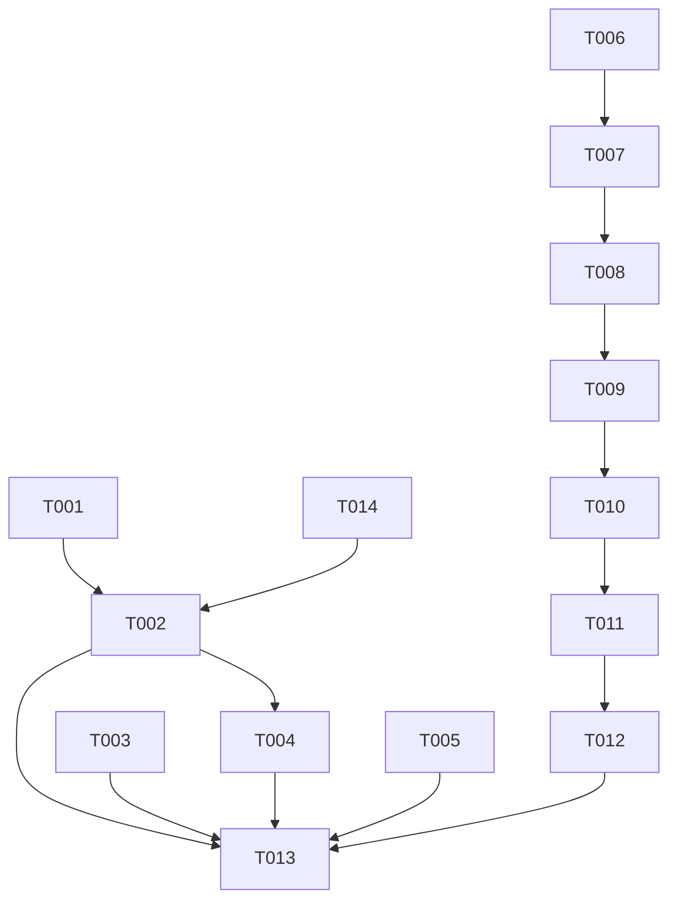

# CLI Tam Onarım — Artım 2 · Uygulama Planı

## GOAL

Palbase CLI'ın üç kusuru bu koşuda kapanıyor. (1) `palbase start` hangi yığını kaldırdığını
BİLMİYOR ve söylemiyor: imaj etiketi projeye değil binary'ye ait, ve dört pinden biri
(`pgvector/pgvector:pg16`) hiçbir Go kontrolünde yok — parite kapısı yalnız `stackImages`'i
döngülediği için onu yapısal olarak göremiyor. (2) `link` dört ayrı komutta yaşıyor ve üçü aynı işi
yapıyor; ayrı komutların geriye kalan tek işi, CLI'ın kendi tavsiyesiyle hiç ulaşılamayan bir bulut
dalı. (3) İkinci bir adresleme mekanizması (`--project/--environment` + `selection.json`) sunucuda
OLMAYAN bir rotaya dayanıyor (`GET /api/v2/projects`, `selection/resolve.go:192`), yani bayraklar
15+ komutta sessizce hiçbir şey seçmiyor. Koşu bittiğinde: proje kendi yığın sürümünü beyan eder ve
`start` kaldırdığı imajları yazar; tek `palbase link` platformu algılar ve emekli komutlar shim
BIRAKMADAN gider; seçim katmanı ile ona dayanan ölü kol (`internal/apps` 617 satır, `internal/hook`
494 satır, github kolu) silinir; ve Artım 1'de bilerek ertelenen rota kapısı — kendisini yeşil yapan
işle birlikte — yerine konur.

**Top 3 constraints:**
1. **FR-015 önce, FR-016 sonra.** Rota kapısı, ölü `/api/v2/projects` çağrısı dururken doğarsa
   KIRMIZI doğar. Artım 1'de tam bu sebeple ertelendi (Changelog A-3, numara 008 boş bırakıldı).
2. **Emekli komut = komutun YOKLUĞU (D-053).** "Bu komut kaldırıldı, şunu kullan" dalı bırakmak,
   sökülen yüzeyi başka biçimde yaşatmaktır. Cobra'nın bilinmeyen-komut hatası zaten `exit ≠ 0`
   veriyor. Shim, uyarı-ve-devam, yönlendirme YOK.
3. **Artım 1'in kapıları bozulmaz (NFR-004).** gofmt · vet · e2e-vet · golangci-lint (CI **ve**
   release) · `requireToolOnCI` · `requiresRealToolchain` · `-short ≤ 180 sn`.

---

## Görevler

### T001: `.palbase/project.json` yığın sürümünü taşısın
<!-- deps: [] | files: [internal/backend/target.go, internal/backend/target_test.go] | satisfies: [FR-001] -->

**Interfaces**
- Produces: `func stackVersion(dir string) (string, error)` — checkout'un beyan ettiği yığın sürümü;
  alan yoksa kurulu `@palbase/backend`'den türetir, `.palbase/project.json`'a YAZAR ve yazdığını
  döndürür. Kurulu SDK yoksa hata döndürür (sessiz varsayılana DÜŞMEZ — D-036'nın Supabase tuzağı).
- Produces: `Target.StackVersion string \`json:"stackVersion,omitempty"\`` alanı.

**Kanıt:** CB-44 (`project.json` commit'lenir, `local.json` gitignore'lanır) · CB-45 (`Target`'ta
sürüm alanı yok, `target.go:34-49`).

- [x] **Adım 1: Kırmızıyı yaz** — `internal/backend/target_test.go`'ya: alan taşıyan bir
  `project.json` için `stackVersion` onu döndürür; alansız dosya + kurulu SDK için TÜRETİR ve
  DOSYAYA YAZAR (ikinci çağrı ağa/npm'e gitmeden aynı değeri döndürür); SDK yoksa hata mesajı
  `@palbase/backend` adını GEÇİRİR.
- [x] **Adım 2: Kırmızıyı gör** — Run: `go test ./internal/backend/ -run TestStackVersion -count=1` ·
  Beklenen: **FAIL**, `undefined: stackVersion`.
- [x] **Adım 3: `Target`'a alanı ekle** — `target.go`'da struct'a:
  ```go
  // StackVersion is the semantic version of the stack this project runs.
  //
  // ONE field, not one per service. Handing somebody a tag per container hands
  // them a compatibility matrix (D-036: Supabase hides all 14 image fields with
  // `toml:"-"`, and that is a considered refusal, not an oversight).
  //
  // It lives in the COMMITTED file on purpose. Supabase writes the equivalent to
  // `.temp/`, which `supabase init` gitignores — so a fresh clone and every CI
  // runner silently get a different stack than the machine that linked it.
  StackVersion string `json:"stackVersion,omitempty"`
  ```
- [x] **Adım 4: `stackVersion` yaz** — alan varsa döndür; yoksa `installedBackendVersion(dir)`'den
  majörü türet, `Target`'a yaz, dosyayı kaydet, döndür. SDK yoksa:
  `fmt.Errorf("this checkout declares no stack version and %s is not installed — run `npm install` first, or set stackVersion in .palbase/project.json", backendPkg)`.
- [x] **Adım 5: Yeşili gör** — Run: `go test ./internal/backend/ -run TestStackVersion -count=1` ·
  Beklenen: `ok`.
- [x] **Adım 6: Commit** — `git commit -- internal/backend/target.go internal/backend/target_test.go`

---

### T014: Sürüm→imaj tablosunu `@palbase/backend` paketine KOY
<!-- deps: [] | files: [../palbase-ts/backend/stack-images.json, ../palbase-ts/backend/package.json, ../palbase-ts/backend/__tests__/stack-images.test.ts] | satisfies: [FR-002] -->

**Neden bu görev var (Changelog A-3):** pre-flight ölçümü, paketin (v33.0.0) böyle bir tablo
TAŞIMADIĞINI gösterdi. Yalnız CLI yarısını yazmak `palbase start`'ı KIRARDI — tablo yok, imaj yok,
yığın kalkmaz. Kullanıcı kararı: tablo pakete girer, sürüm kesilir.

**AYRI DEPO:** `sdk/palbase-ts` kendi git'i olan bir depo. Commit'ler orada, pathspec ile.

**Interfaces**
- Produces: `stack-images.json` — `{"<major>": [{"env": "...", "ref": "...", "build": "..."}]}`
  şeklinde; bugün CLI'ın `stackImages`'inde duran dört imajın aynısı (T003 sonrası `postgres` dâhil).

- [x] **Adım 1: Kırmızıyı yaz** — `__tests__/stack-images.test.ts`: tablo JSON olarak
  ayrıştırılabilir; şu anki majör için DÖRT imaj taşır; her girdi `env` ve `ref` alanlarını taşır;
  her `ref` bir registry adresi (`/` içerir) — yerel etiket DEĞİL.
- [x] **Adım 2: Kırmızıyı gör** — Run: `cd ../palbase-ts && npx vitest run backend/__tests__/stack-images.test.ts` ·
  Beklenen: **FAIL**, dosya yok.
- [x] **Adım 3: Tabloyu yaz** — `stack-images.json`, CLI'daki dört pinin ETİKETLERİYLE birebir
  (kaynak: `internal/backend/start.go` `stackImages` + compose'un `postgres` satırı).
- [x] **Adım 4: `files`'a ekle** — `package.json`'ın `files` dizisine `stack-images.json`; yoksa
  paket yayınlanınca tablo GİTMEZ ve CLI onu bulamaz.
- [x] **Adım 5: Yeşili gör** — Run: `cd ../palbase-ts && npx vitest run backend/__tests__/stack-images.test.ts` ·
  Beklenen: `ok`. Ayrıca `npm pack --dry-run` çıktısında `stack-images.json` GÖRÜNMELİ.
- [x] **Adım 6: Commit (SDK deposunda, pathspec ile)** — `git -C ../palbase-ts commit -- backend/stack-images.json backend/package.json backend/__tests__/stack-images.test.ts`

---

### T002: Sürüm→imaj tablosu `@palbase/backend`'den okunsun ve `start` onu KULLANSIN
<!-- deps: [T001, T014, T003] | files: [internal/backend/start.go, internal/backend/start_test.go] | satisfies: [FR-002, FR-003] -->

**Interfaces**
- Consumes: `stackVersion(dir string) (string, error)` (T001).
- Produces: `func imagesFor(dir, version string) ([]stackImage, error)` — tabloyu kurulu
  `@palbase/backend` paketinden çözer. Bilinmeyen sürüm ADIYLA reddedilir, en yakına YUVARLANMAZ.
- Produces: `type stackImage struct{ env, ref, build string }` — bugünkü anonim struct'ın adı.

**Kanıt:** D-023 (tablo SDK paketinde — Expo'nun hamlesi; tazelemek için `npm i` yeter, CLI sürümü
gerekmez) · D-030 (ağ ucu YOK).

- [x] **Adım 1: Kırmızıyı yaz** — `start_test.go`'ya: tablo dosyası taşıyan sahte bir
  `node_modules/@palbase/backend` için `imagesFor` dört imajı döndürür; tabloda olmayan bir sürüm
  için hata **sürümü adıyla** geçirir; tablo dosyası yoksa hata `@palbase/backend`'i adlandırır.
- [x] **Adım 2: Kırmızıyı gör** — Run: `go test ./internal/backend/ -run TestImagesFor -count=1` ·
  Beklenen: **FAIL**, `undefined: imagesFor`.
- [x] **Adım 3: `imagesFor` yaz** — `node_modules/@palbase/backend/stack-images.json`'ı okur,
  `version` anahtarıyla çözer. Bulunamayan sürüm:
  `fmt.Errorf("%s knows no stack images for version %q — the versions it carries are: %s", backendPkg, version, strings.Join(known, ", "))`.
- [x] **Adım 4: `start` çözülen imajları YAZSIN** — `runStart`'ta, `▸ starting %s` satırından sonra
  her imajı etiketiyle bas:
  ```go
  // WHAT IT ACTUALLY BRINGS UP, NAMED.
  //
  // This command printed the project name and nothing else, so "start ran but
  // the wrong stack came up" was invisible until something failed downstream.
  for _, img := range images {
      fmt.Fprintf(out, "  %s\n", img.ref)
  }
  ```
- [x] **Adım 5: Yeşili gör** — Run: `go test ./internal/backend/ -run 'TestImagesFor|TestStart' -count=1` ·
  Beklenen: `ok`.
- [x] **Adım 6: Commit** — `git commit -- internal/backend/start.go internal/backend/start_test.go`

---

### T003: Dört pinin DÖRDÜ de tek mekanizmada; parite kapısı hepsini görsün
<!-- deps: [] | files: [internal/backend/stackfiles/docker-compose.dev.yml, internal/backend/stackfiles_test.go, ../../v2/deploy/docker-compose.dev.yml, internal/backend/start.go] | satisfies: [FR-005] -->

**Kanıt:** CB-46 — compose dört `image:` taşıyor; `postgres`'inki `pgvector/pgvector:pg16` SABİT
(değişkensiz), `stackImages` üç eleman, `grep -rn pgvector --include="*.go" internal/` → boş. Parite
kapısı (`stackfiles_test.go:236`) yalnız `stackImages`'i döngülüyor, yani o pini YAPISAL OLARAK
göremiyor.

- [x] **Adım 1: Kırmızıyı yaz** — `stackfiles_test.go`'ya: compose'daki HER `image:` satırının bir
  `${VAR:-default}` taşıdığını ve o VAR'ın Go tarafında bilindiğini ölçen bir test. Bugün
  `postgres` bunu ihlal ediyor.
- [x] **Adım 2: Kırmızıyı gör** — Run: `go test ./internal/backend/ -run TestEveryComposeImageIsPinnedInOnePlace -count=1` ·
  Beklenen: **FAIL**, `postgres` satırını adıyla listeler.
- [x] **Adım 3: `postgres` pinini değişkene bağla — İKİ dosyada** — vendor'lanan kopyada VE
  `v2/deploy`'daki orijinalde (parite kapısı ikisini karşılaştırıyor; yalnız birini değiştirmek onu
  kırar — Changelog A-4): `image: ${PALBASE_POSTGRES_IMAGE:-pgvector/pgvector:pg16}`. Varsayılan
  AYNI kalıyor, yani koşan yığın değişmiyor. Ayrıca `stackImages`'e dördüncü eleman —
  **`stackImages` `start.go:65`'te yaşıyor, `stackfiles.go`'da değil** (plan ilk yazımda yanlış
  dosyayı gösteriyordu; ölçüldü).
- [x] **Adım 3b: `isRegistryImage` Docker Hub kısa formunu TANISIN** — `postgres`'i pin listesine
  eklemek Artım 1'in gerekçesini çürütüyor: yorum *"nothing in this stack defaults to one"* diyordu,
  artık ediyor. Düzeltilmezse `ensureImages` `pgvector/pgvector:pg16`'yı YEREL sanıp ilk koşuda
  *"image is not on this machine"* ile düşerdi — çalışan bir komutu kırmak. Kural sadeleşiyor: slash
  varsa registry referansıdır. `stackfiles_test.go:174`'teki beklenti ve gerekçe yorumu da düzelir.
- [x] **Adım 4: Yeşili gör** — Run: `go test ./internal/backend/ -run 'TestEveryComposeImage|TestTheGoConstants|TestTheVendoredCompose' -count=1` ·
  Beklenen: `ok` — ve `docker compose config` hâlâ geçiyor.
- [x] **Adım 5: Negatif kontrol** — `postgres`'i sabite geri döndür, testin KIRMIZIYA döndüğünü gör,
  geri al. *(Kapı gerçekten ölçüyor mu — Artım 1'in merkez dersi.)*
- [x] **Adım 6: Commit** — `git commit -- internal/backend/stackfiles.go internal/backend/stackfiles/docker-compose.dev.yml internal/backend/stackfiles_test.go`

---

### T004: Hazırlık runtime'ı da kanıtlasın; `stop` silmeden ÖNCE başarılı olsun
<!-- deps: [T002] | files: [internal/backend/start.go, internal/backend/start_test.go] | satisfies: [FR-004, FR-007] -->

**Kanıt:** CB-43 — `start.go:584` yorumu: *"/readyz routes to the palsvc cluster"*; yani banner
"hazır" derken runtime bundle'ı reddediyor olabilir.

- [x] **Adım 1: Kırmızıyı yaz** — palsvc 200 ama runtime hazır değilken `waitReady`'nin hazır
  DEMEDİĞİNİ ölçen test; ve `stop`'un `local.json`'ı silmeden önce compose'un indiğini doğruladığını
  ölçen test.
- [x] **Adım 2: Kırmızıyı gör** — Run: `go test ./internal/backend/ -run 'TestReady|TestStop' -count=1` ·
  Beklenen: **FAIL**.
- [x] **Adım 3: Hazırlığı runtime'a da sor** — `/readyz`'e ek olarak runtime'ın kendi hazırlık
  ucunu yokla; ikisi de yeşil olmadan banner basılmasın.
- [x] **Adım 4: `stop` sırasını düzelt** — `.palbase/local.json` silinmesi, compose'un başarıyla
  indiği doğrulandıktan SONRA; ve `stop` vendor'lanan compose belgesini yeniden YAZMASIN.
- [x] **Adım 5: Yeşili gör** — Run: `go test ./internal/backend/ -run 'TestReady|TestStop' -count=1`
- [x] **Adım 6: Commit** — `git commit -- internal/backend/start.go internal/backend/start_test.go`

---

### T005: `upgrade` yerel yığında ölü uç adlandırmayı bıraksın
<!-- deps: [] | files: [internal/backend/upgrade.go, internal/backend/upgrade_test.go] | satisfies: [FR-006] -->

**Kanıt:** CB-42 — `upgrade.go:52-62`, `len(labels) < 3 || !refPattern.MatchString(labels[0])` → `""`.
`localhost` tek label; `127.0.0.1`'in ilk label'ı desene uymuyor.

- [x] **Adım 1: Kırmızıyı yaz** — loopback hedefli bir checkout'ta `upgrade`'in ne yapamadığını
  ADIYLA söylediğini ölçen test (bugün boş ref ile ölü uca düşüyor).
- [x] **Adım 2: Kırmızıyı gör** — Run: `go test ./internal/backend/ -run TestUpgradeOnALocalStack -count=1`
- [x] **Adım 3: Ölü ucu kapat** — ref çözülemiyorsa komut, yerel bir yığında bu fiilin ne anlama
  geldiğini söyleyerek reddetsin; boş ref'le devam etmesin.
- [x] **Adım 4: Yeşili gör** — Run: `go test ./internal/backend/ -run TestUpgrade -count=1`
- [x] **Adım 5: Commit** — `git commit -- internal/backend/upgrade.go internal/backend/upgrade_test.go`

---

### T006: Tek `palbase link` platformu ALGILASIN
<!-- deps: [] | files: [internal/backend/project_link.go, internal/backend/planes.go, internal/backend/project_link_test.go] | satisfies: [FR-008] -->

**Interfaces**
- Produces: `func detectPlatforms(dir string) []Platform` — `hasApple`/`hasWeb`/
  `detectAndroidApplicationID` bunun altına iner.

**Kanıt:** CB-40 — `planes.go:132 hasApple`, `planes.go:153 hasWeb`,
`native_link.go:429 detectAndroidApplicationID`.

- [x] **Adım 1: Kırmızıyı yaz** — Apple+web taşıyan bir fikstürde `detectPlatforms` ikisini de
  döndürür; hiçbiri yoksa boş döner ve `link` ne aradığını + nerede bulamadığını SÖYLER.
- [x] **Adım 2: Kırmızıyı gör** — Run: `go test ./internal/backend/ -run TestDetectPlatforms -count=1`
- [x] **Adım 3: `detectPlatforms` yaz + `link`'e bağla** — çıplak `link` algılananların hepsi için
  artefakt yazsın.
- [x] **Adım 4: Yeşili gör** — Run: `go test ./internal/backend/ -run 'TestDetectPlatforms|TestLink' -count=1`
- [x] **Adım 5: Commit** — `git commit -- internal/backend/project_link.go internal/backend/planes.go internal/backend/project_link_test.go`

---

### T007: `--platform` bilinmeyen değeri REDDETSİN + `palbase unlink`
<!-- deps: [T006] | files: [internal/backend/project_link.go, internal/backend/project_link_test.go] | satisfies: [FR-010, FR-011] -->

**Kanıt:** CB-41 — `project_link.go:127`, `StringSliceVar(..., []string{"ios"}, ...)`, doğrulama yok.

- [x] **Adım 1: Kırmızıyı yaz** — `--platform bogus` reddedilir ve mesaj geçerli değerleri sayar;
  `unlink` bağı kaldırır ve bağsız checkout'ta ne bulamadığını söyler.
- [x] **Adım 2: Kırmızıyı gör** — Run: `go test ./internal/backend/ -run 'TestPlatformFlag|TestUnlink' -count=1`
- [x] **Adım 3: Doğrulama + `unlink` yaz**
- [x] **Adım 4: Yeşili gör** — aynı komut, `ok`
- [x] **Adım 5: Commit** — `git commit -- internal/backend/project_link.go internal/backend/project_link_test.go`

---

### T008: Emekli komutları SÖK — shim bırakmadan
<!-- deps: [T007] | files: [internal/backend/backend.go, internal/backend/native_link.go, internal/backend/web_link.go, internal/backend/android_link.go, internal/backend/ios_use.go, cmd/palbase/main.go, cmd/palbase/surface_test.go] | satisfies: [FR-009] -->

**Kanıt:** CB-36 (iki `link`: `web_link.go:231`, `native_link.go:112`) · CB-37 (dört grup:
`native_link.go:76/87`, `android_link.go:9`, `web_link.go:218`) · CB-38 (`ios_use.go:36`
`Use: "use <environment>"`) · kayıt yeri `backend.go:148-151`.

**D-053:** "kaldırıldı" dalı YOK. Komut hiç var olmaz; cobra'nın bilinmeyen-komut hatası `exit ≠ 0`
veriyor.

- [ ] **Adım 1: Kırmızıyı yaz** — `surface_test.go`'nun golden listesinden `ios`/`macos`/`android`/
  `web` çıkar; ve emekli komutların YOKLUĞUNU ölçen bir test: `palbase ios link` çalıştırıldığında
  `exit ≠ 0` ve çıktı bir "kaldırıldı/deprecated/use instead" cümlesi İÇERMEZ.
- [ ] **Adım 2: Kırmızıyı gör** — Run: `go test ./cmd/palbase/ -run 'TestGolden|TestRetiredCommands' -count=1` ·
  Beklenen: **FAIL** (komutlar hâlâ kayıtlı).
- [ ] **Adım 3: Kaydı kaldır** — `backend.go:148-151`'den dört satır; `ios_use.go` **silinir**;
  `native_link.go`/`web_link.go`/`android_link.go`'da yalnız komut sarmalayıcıları gider, ortak
  çözüm yardımcıları KALIR (T009 onları tekilleştirecek).
- [ ] **Adım 4: Yeşili gör** — Run: `go test ./cmd/palbase/ ./internal/backend/ -count=1 -short` ·
  Beklenen: `ok`, ve `go build ./...` temiz.
- [ ] **Adım 5: Commit** — `git commit -- internal/backend/backend.go internal/backend/native_link.go internal/backend/web_link.go internal/backend/android_link.go internal/backend/ios_use.go cmd/palbase/main.go cmd/palbase/surface_test.go`

---

### T009: Örtüşen yardımcıları TEKİLLEŞTİR
<!-- deps: [T008] | files: [internal/backend/app_environments.go, internal/backend/cloud_environments.go, internal/backend/native_link.go, internal/backend/web_link.go] | satisfies: [FR-012] -->

**Kanıt:** CB-39 — `app_environments.go:612 gatherEnvironments` ↔ `cloud_environments.go:167
addLocalStack`; `native_link.go:381 resolveNativeApp` ↔ `web_link.go:148 resolveWebApp`.

- [ ] **Adım 1: Örtüşmeyi ÖLÇ** — iki çiftin diff'ini al ve rapora yaz (tasarım "%95" ve "35 satırın
  30'u" diyor; bugünkü sayı ölçülecek — bayat olabilir, CB-46 gibi).
- [ ] **Adım 2: Kırmızıyı yaz** — tek yardımcının her iki çağıranın davranışını da karşıladığını
  ölçen test.
- [ ] **Adım 3: Birleştir** — tek uygulama kalır; ikinci kopya silinir.
- [ ] **Adım 4: Yeşili gör** — Run: `go test ./internal/backend/ -count=1 -short`
- [ ] **Adım 5: Commit** — pathspec ile dört dosya

---

### T010: Seçim katmanını SÖK ve ölü rota çağrısını kaldır
<!-- deps: [T009] | files: [internal/selection/resolve.go, internal/selection/config.go, internal/selectiontest/fake.go, tests/e2e/mgmt_api_test.go] | satisfies: [FR-013, FR-015] -->

**Kanıt:** CB-30 (`resolve.go:192` ölü rotayı çağırıyor) · CB-31 (paket 1311 satır).
**D-051:** `tests/e2e` SİLİNMEZ — seçim-katmanı bağımlılığından arındırılır. Artım 1 o pakete
bloklayıcı bir CI kapısı bağladı; silmek kapıyı da götürür.

- [ ] **Adım 1: Kırmızıyı yaz** — `--project`/`--environment` bayraklarının ARTIK OLMADIĞINI ve
  `selection.json`'ın OKUNMADIĞINI ölçen test; kalıntı `selection.json` taşıyan checkout'ta komut
  DÜŞMEZ, dosyanın okunmadığını söyler (spec sınır durumu).
- [ ] **Adım 2: Kırmızıyı gör** — Run: `go test ./internal/selection/ ./internal/backend/ -run 'TestSelection|TestNoSelectionFlags' -count=1`
- [ ] **Adım 3: Sök** — bayraklar, `selection.json` okuyucusu/yazıcısı, ve `resolve.go:192`'deki
  `GET /api/v2/projects` çağrısı gider. `selectiontest/fake.go`'dan o rotanın fikstürü gider.
- [ ] **Adım 4: `tests/e2e`'yi arındır** — seçim katmanına bağlı kalan varsa kaldır; paket
  DERLENMEYE devam etsin.
- [ ] **Adım 5: Yeşili gör** — Run: `go test ./... -count=1 -short` **ve** `go vet -tags e2e ./tests/e2e/` ·
  Beklenen: ikisi de temiz.
- [ ] **Adım 6: Commit** — pathspec ile dört dosya

---

### T011: `internal/apps`, `internal/hook` ve github kolunu SİL
<!-- deps: [T010] | files: [internal/apps/, internal/hook/, internal/backend/deploy.go] | satisfies: [FR-014] -->

**Kanıt:** CB-32 (617 satır) · CB-33 (494 satır) · CB-35 (github kolunun 12 üretim referansı).

- [ ] **Adım 1: Çağıranları ÖLÇ** — `grep -rn` ile her üçünün üretim çağıranlarını listele; sıfır
  olmayanlar T010'un sökümüyle düşmüş olmalı.
- [ ] **Adım 2: Sil** — iki dizin + `deploy.go`'daki github dalı. Shim, "bu kaldırıldı" mesajı,
  bayrak kalıntısı YOK.
- [ ] **Adım 3: Yeşili gör** — Run: `go build ./... && go vet ./... && go test ./... -count=1 -short` ·
  Beklenen: hepsi temiz; `golangci-lint` `unused` raporlamıyor.
- [ ] **Adım 4: Commit** — `git commit -- internal/apps internal/hook internal/backend/deploy.go`

---

### T012: Rota literali ↔ sunucu rotası kapısı (Artım 1'in ertelenen 008'i)
<!-- deps: [T011] | files: [cmd/palbase/routes_test.go] | satisfies: [FR-016] -->

**Interfaces**
- Produces: `func routeLiterals(root string) ([]RouteLiteral, error)` — AST ile (`go/parser`),
  regex DEĞİL. Artım 1'de aynı desen `surface_test.go:673`'te kanıtlandı; regex tabanlı ilk denemesi
  ham TypeScript dizeleri yüzünden yanlış sayım vermişti.

**Sıralama:** T011'den SONRA, çünkü FR-015'in kaldırdığı `/api/v2/projects` dururken bu kapı KIRMIZI
doğardı — Artım 1'de tam bu sebeple ertelendi.

- [ ] **Adım 1: Kapıyı yaz** — kaynak ağacındaki HTTP rota literallerini topla ve sunucunun servis
  ettiği rotalara karşı ölç. Çözülemeyen literal (değişkenden kurulan yol) ADLANDIRILIR ve
  "ölçemedim" denir — sessizce atlanmaz (Artım 1'in N-2 dersi).
- [ ] **Adım 2: DOĞDUĞU GÜN YEŞİL mi** — Run: `go test ./cmd/palbase/ -run TestEveryRouteLiteralIsServed -count=1` ·
  Beklenen: `ok`. Kırmızıysa **kapı değil kod düzeltilir** (advisory kapı yasak, NFR-002).
- [ ] **Adım 3: Negatif kontrol** — kaynağa var olmayan bir rota literali enjekte et, kapının
  KIRMIZIYA döndüğünü ve rotayı `file:line` ile adlandırdığını gör, geri al.
- [ ] **Adım 4: Commit** — `git commit -- cmd/palbase/routes_test.go`

---

### T013: WIRING + KANIT — `init` → `start` → `link` → `push` üretim yolundan
<!-- deps: [T002, T003, T004, T005, T012] | files: [internal/backend/link_e2e_test.go] | satisfies: [FR-017] -->

**Bu görev envanteri CAPABILITY'ye çevirir.** Derlenmiş binary üzerinden koşar; fonksiyonları elle
sıralayan bir test SAYILMAZ.

- [ ] **Adım 1: Zinciri yaz** — `palbaseBinary(t)` ile derlenmiş binary; boş dizinde `init`, sonra
  `start`, sonra çıplak `link` (platform ALGILANIR), sonra `push`'un artefaktı ürettiği nokta.
  `requiresRealToolchain(t)` kapısı takılır (NFR-001: `-short` bütçesi).
- [ ] **Adım 2: Koş ve gör** — Run: `go test ./internal/backend/ -run TestTheWholeChainFromInitToPush -count=1 -v` ·
  Beklenen: `--- PASS`, ve çıktıda `start`'ın bastığı DÖRT imaj etiketi görünür (FR-003'ün kanıtı
  üretim yolundan).
- [ ] **Adım 3: Commit** — `git commit -- internal/backend/link_e2e_test.go`

---

## Dependencies

`T014` (SDK tablosu, ayrı depo) ile `T001` paralel; `T001+T014 → T002 → T004` zinciri `start.go`'yu paylaştığı için seri. `T003` (compose/stackfiles) ve
`T005` (upgrade.go) hiçbir şeye dokunmuyor → wave 1'de paralel. Kol D (`T006 → T007 → T008 → T009`)
`project_link.go` ve link dosyalarını paylaştığı için seri; Kol E (`T010 → T011`) onların söktüğü
yüzeyin ardından gelir. `T012` **T011'den sonra** — ertelenen kapının tüm sebebi bu. `T013` her şeyi
üretim yolundan kanıtlar.



## FR Coverage

| FR | Görev |
|---|---|
| FR-001 | T001 |
| FR-002 | T014, T002 |
| FR-003 | T002 |
| FR-004 | T004 |
| FR-005 | T003 |
| FR-006 | T005 |
| FR-007 | T004 |
| FR-008 | T006 |
| FR-009 | T008 |
| FR-010 | T007 |
| FR-011 | T007 |
| FR-012 | T009 |
| FR-013 | T010 |
| FR-014 | T011 |
| FR-015 | T010 |
| FR-016 | T012 |
| FR-017 | T013 |

## UAT Checklist

**Doğrulama yetenekleri envanteri:** derlenmiş binary + gerçek `docker` daemon (Artım 1'de
`TestStartServesAndStopCleansUp` 128 sn'de geçti) · gerçek `npm` · `gh` CLI (CI koşuları) ·
`golangci-lint` · `go/parser`. Bu envanterle aşağıdakilerin hepsi `[agent]`.

- [ ] **UAT-1 [agent]** — Boş dizinde `palbase init`; `.palbase/project.json` bir `stackVersion`
  taşıyor. Evidence:
- [ ] **UAT-2 [agent]** — `palbase start` DÖRT imaj etiketini basıyor ve yığın gerçekten kalkıyor.
  Evidence:
- [ ] **UAT-3 [agent]** — `palbase ios link` → `exit ≠ 0`, ve çıktı "kaldırıldı/use instead" gibi bir
  yönlendirme İÇERMİYOR (D-053). Evidence:
- [ ] **UAT-4 [agent]** — Apple+web taşıyan bir checkout'ta çıplak `palbase link` ikisini de
  algılıyor ve artefaktları yazıyor. Evidence:
- [ ] **UAT-5 [agent]** — `palbase link --platform bogus` → reddediyor ve geçerli değerleri sayıyor.
  Evidence:
- [ ] **UAT-6 [agent]** — `palbase --help` çıktısında `--project`/`--environment` YOK; kalıntı
  `selection.json` taşıyan checkout'ta komut düşmüyor. Evidence:
- [ ] **UAT-7 [agent]** — `grep -rn "/api/v2/projects\"" --include="*.go" .` üretim kodunda sıfır
  eşleşme. Evidence:
- [ ] **UAT-8 [agent]** — Rota kapısı negatif kontrolde kırmızıya dönüyor. Evidence:
- [ ] **UAT-9 [agent]** — `go test ./... -short` ≤ 180 sn ve 0 FAIL; `golangci-lint` 0 issues; CI
  yeşil. Evidence:

## Fidelity Audit

- **Şartnamede karşılığı olmayan öğe:** none — T014'ün üç dosyası A-3 ile Impact Map'e girdi.
- **`C-n`'den farklı imza:** none — `stackVersion`, `imagesFor`, `detectPlatforms`, `routeLiterals`
  dördü de spec'in Bileşen Yüzeyi'nden birebir alındı (`imagesFor`'a `dir` parametresi eklendi;
  spec'in `[PLAN-FREE: iç yardımcılar]` işareti bunu kapsıyor — tablo kurulu paketten okunuyor ve
  paket checkout'a göreli).
- **Planlama sırasında yapılan şartname değişikliği:** **VAR — A-2.** `validate` altı dosyanın
  haritada olmadığını gösterdi (beş test dosyası + `backend.go`); plan onları yazacaktı, yani harita
  eksikti — `files:`'ı kırpmak yerine harita düzeltildi (§7'nin amend yolu). Ayrıca iki metin
  kusuru: "Neden" sütununda backtick içine yazılan bir dosya adı validator tarafından YOL
  sanılıyordu, ve Artım 1'in bir gereksinim numarasına yapılan atıf bu şartnamenin kapsama
  tablosunda tanımsız bir FR olarak görünüyordu. Üçü de şartnamede düzeltildi, changelog'a işlendi,
  spec exit gate yeniden koşuldu (4/4).
